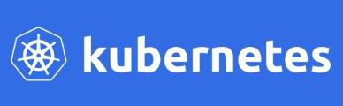
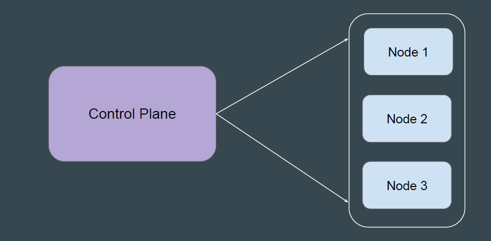
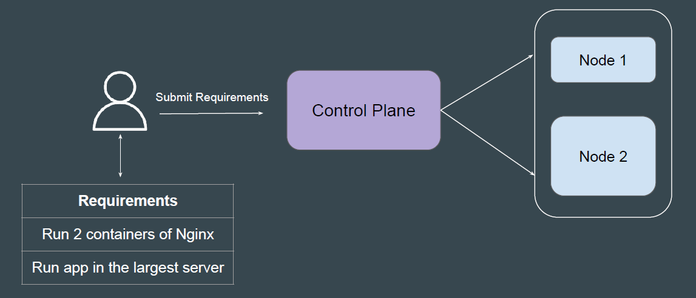
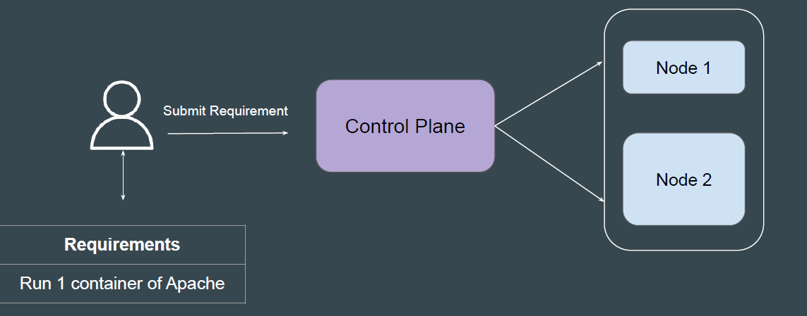
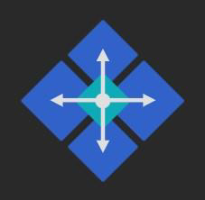

# Introduction to Kubernetes

Kubernetes (K8s) is an open-source container orchestration engine developed
by Google.
It was originally designed by Google, and is now maintained by the Cloud Native
Computing Foundation.

## Architecture of Kubernetes

A Kubernetes cluster consists of a control plane + a set of worker machines,
called nodes, that run containerized applications

## Basic Workflow

User communicates to Control Plane and provides necessary instructions to run
containerized applications.

## Example - Run 1 Container of Apache

If you have instructed Kubernetes to run 1 container of Apache, Kubernetes will
launch it in one of the worker nodes and will regularly monitor the state of that
container to ensure it always runs.

## Kubernetes is Awesome

Kubernetes provides amazing set of features and is designed on the same
principles that allow Google to run billions of containers a week.

Some of the popular features include:
- Pod Auto-Scaling
- Service discovery and load balancing
- Self-Healing of Containers
- Secret management
- Automated rollouts and rollbacks

