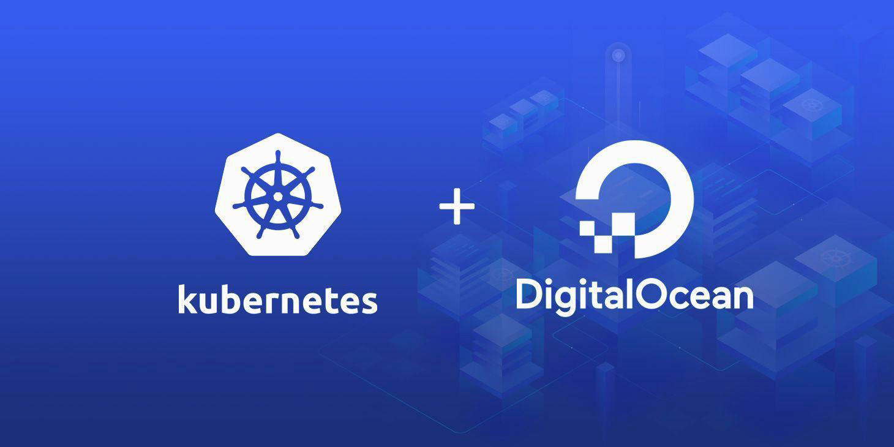
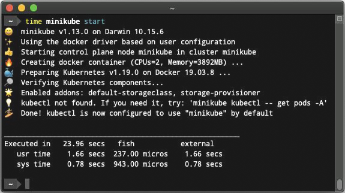
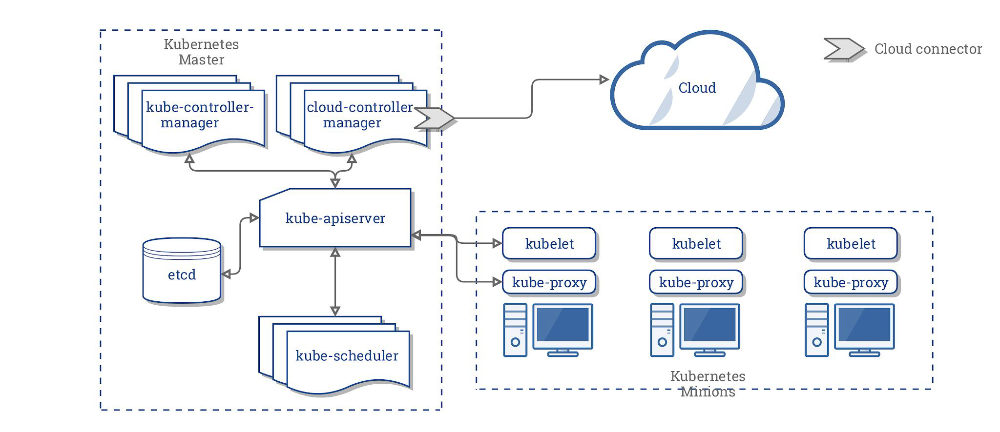

# Installation Options for Kubernetes

## Analogy - Eating your Favorite Food Dish

You want to eat your favourite food dish.
What are the options:
1. Go to store, get ingredients and prepare from scratch.
2. Get ready-made mix, make it hot.
3. Order it from the restaurant.

You want to launch a Kubernetes cluster.
What are the options:
1. Go to K8s website, download individual components and integrate them one
   by one.
2. Use tools like Minikube, Kubeadm to quickly setup K8s cluster for you.
3. Use Managed Kubernetes Service.

## Option 1 - Managed Kubernetes Service

Various providers like AWS, IBM, GCP and others provides managed
Kubernetes clusters.
Analogy: Order Ready-Made Food from Store.

## Option 2 - K8s Development Tools

Various tools like Minikube, K3d allows you to quickly setup the Kubernetes for
local testing.
Analogy: Get ready-made mix, make it hot.

## Option 3 - Setup K8s from Scratch

In this approach, you install and configure each Kubernetes component
individually.

