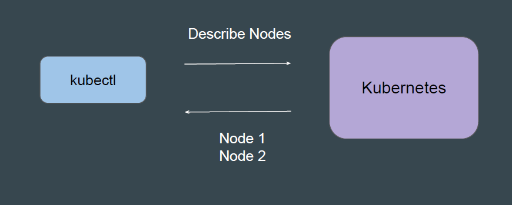
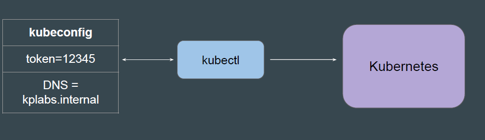
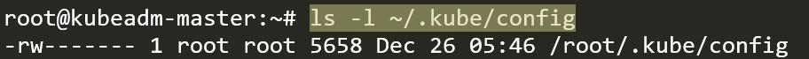
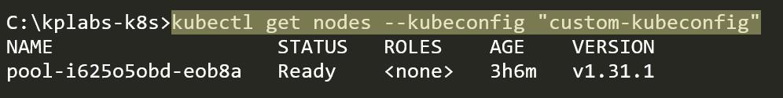

# Overview of kubectl

The Kubernetes command-line tool, kubectl, allows you to run commands
against Kubernetes clusters.



Kubectl needs two important details while connecting to Kubernetes Cluster
1. DNS / IP Address of Kubernetes Control Plane
2. Authentication Credentials.



Kubectl by default will look for the kubeconfig file in a file named config inside
.kube folder in your home directory.

```
~/.kube/config

```



You can also refer to custom config file using the --kubeconfig flag

