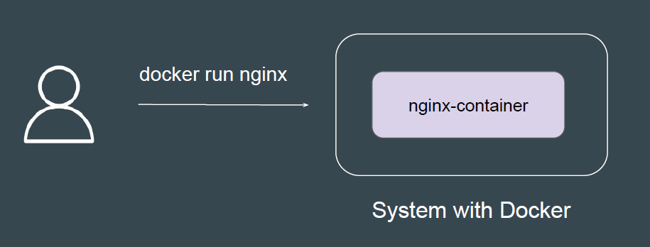
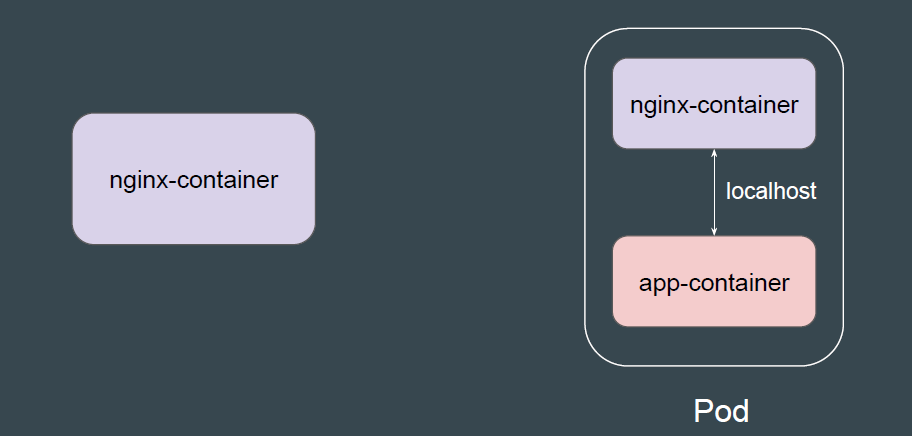
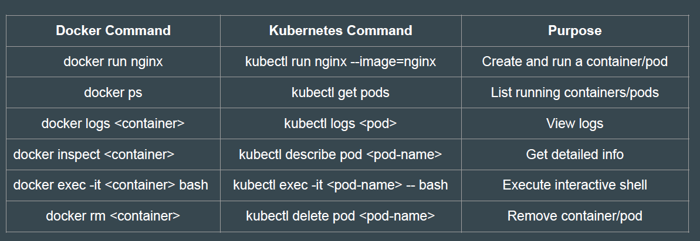

# Basics of Kubernetes Pods

You have recently installed Docker in your system.
What is the first thing that you might do?

## Difference Between Container and Pods

A Pod can contain one or more Docker containers that share the same network
namespace and storage volumes

## Comparison Table - Docker vs Kubernetes Commands

## Points to Note - Kubernetes Pod

- A Pod always runs on a Node.
- A Node is a worker machine in Kubernetes.
- Each Node is managed by the Kubernetes Control Plane.
- A Node can have multiple pods.
