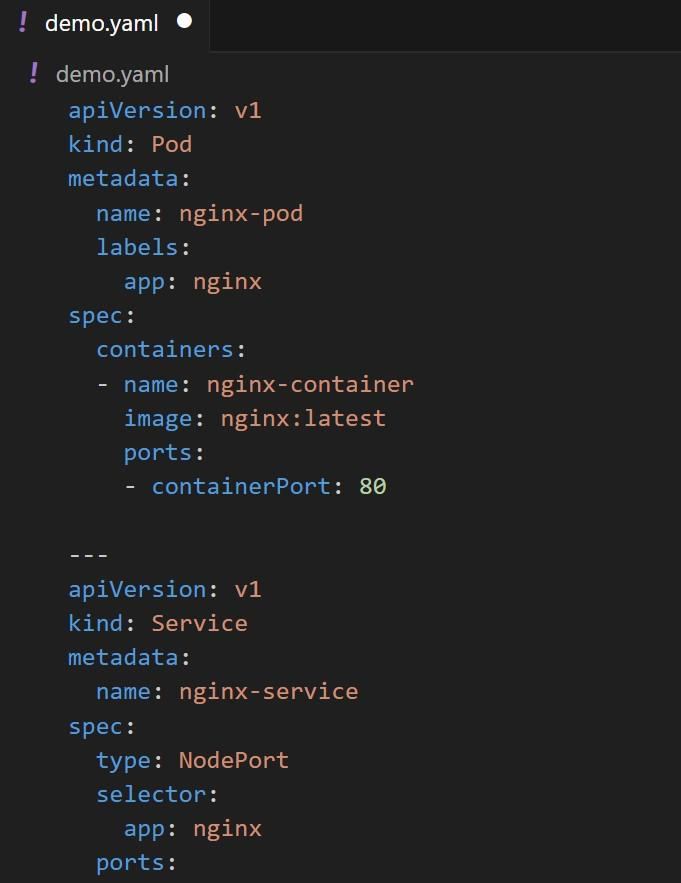

We have been using simple approach of using kubectl command to create
object like Pods in Kubernetes.

## 2 Primary Ways to Create Object

Use kubectl run command or supply kubectl with Manifest file that contains
information of resource to be created.

## Manifest File Example

## Benefits of Manifest File - Version Control

Manifest files can be stored in version control systems like Git, allowing you to
track changes to your infrastructure over time and easily roll back to previous
versions.

## Benefits of Manifest File - Multiple Resources

You can define multiple rest of dependent resource objects that you want to
create in a single manifest file.

