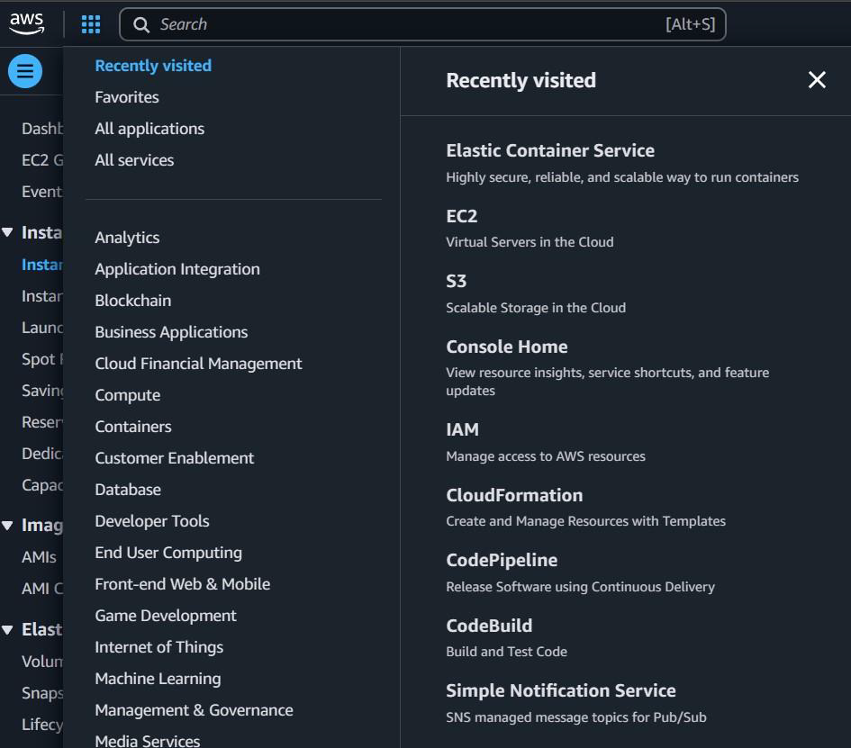
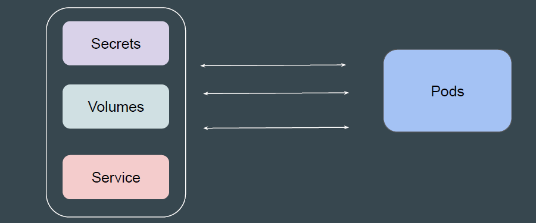
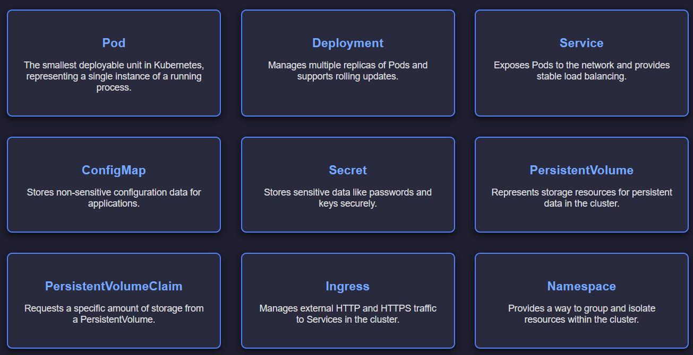
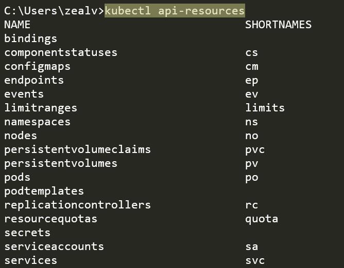

# Basics of Kubernetes Resource Types

## Sample Analogy - Hosting Provider

During the early times, one of the primary offerings of hosting providers was
servers / virtual machines.
Nowadays, there are 100s of services offered by Cloud providers that aid in the
entire lifecycle management of applications and custom use-cases of
organizations.

## Understanding from Kubernetes Perspective

Although Pods allow users to host custom applications in containers, it might not
always be enough.
Based on use-case, Pod might also require access to other Kubernetes Objects.

## Kubernetes Resource Types

Kubernetes has a broad set of resource types that organizations can use based
on their requirements.

## Reference Screenshot

