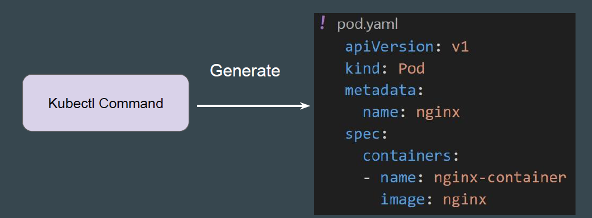
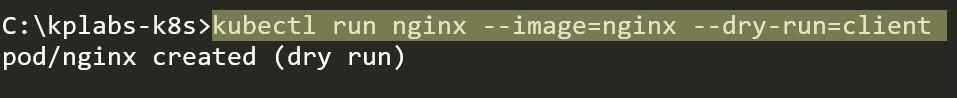
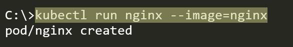
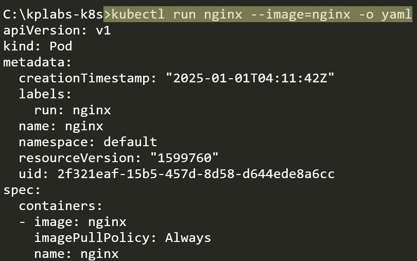
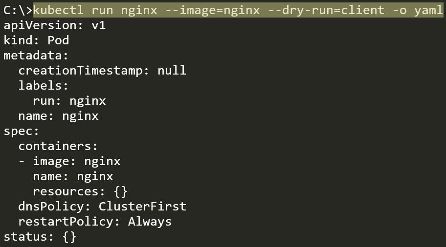

# Generating Manifest File through CLI Command

CLI commands are easy to run, and Manifest file provides a lot of benefits for
organizations and team collaboration.
Finding an easier way to generate a manifest file is needed.

The *--dry-run=client* option allows you to validate a Kubernetes resource
definition without actually applying it to the cluster.

By default, when you run the basic kubectl command to create an object like
Pod, in the output, it will just print the confirmation message.

When kubectl command is used with output of yaml, the command doesn't just
create the resource in the cluster; it also prints the full YAML configuration of the
created resource to your terminal.

When --dry-run=client is combined with -o yaml, it will generate manifest file for
you associated with the command without actually deploying the object in
Kubernetes.

