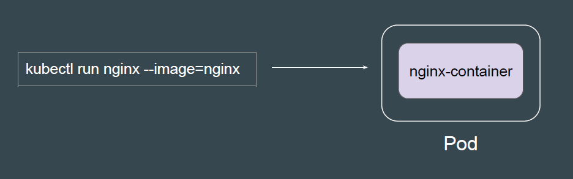

# Multi-Container Pods

## Difference Between Container and Pods

A Pod can contain one or more Docker containers that share the same network
namespace and storage volumes

## Default Option with kubectl Command

The kubectl run command allows us to run a single-container based Pods.
For Pods with multiple container, you need to use Manifest File based approach.

## Multi-Container Pod Configuration
To create a multi-container based Pods, you can defined additional details in
container definition.

## Exec into a Container
By default, when you run the kubectl exec command, it will connect to the first
container.

## Exec into Other Containers in Pod
To connect with other containers of Pod, you can add -c flag with
<container-name> as part of the kubectl exec command

