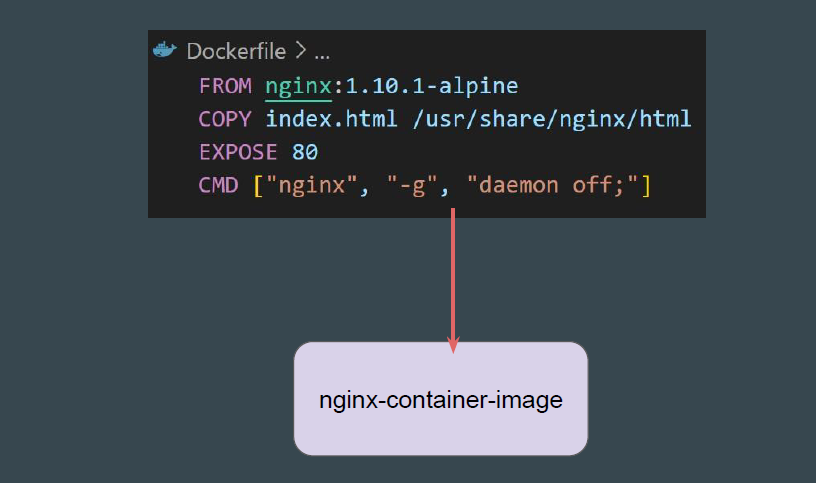
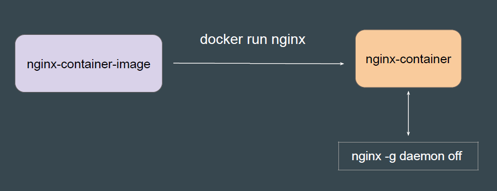
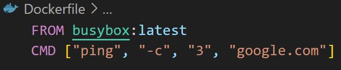
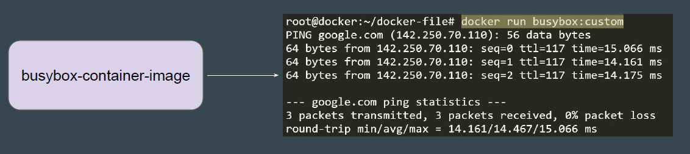
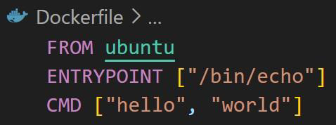
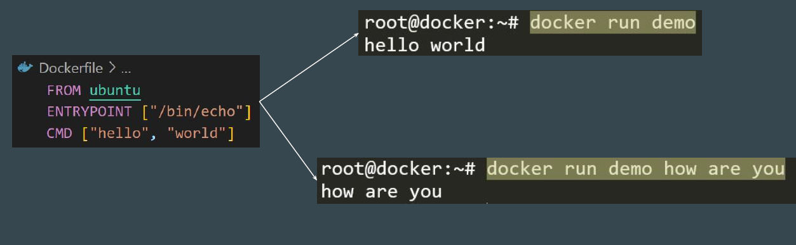
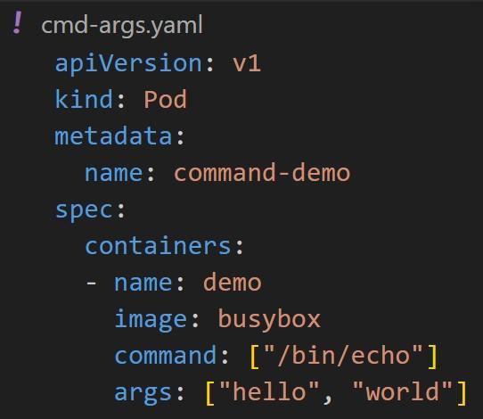

# Overview of Commands and Arguments

## Setting the Base
Whenever a Docker Image is built, it can have a certain ENTRYPOINT / CMD
instructions set that defines what container needs to run when it starts.

## Running Docker Container from Image
Whenever a container starts from Docker Image, it uses the appropriate
ENTRYPOINT / CMD Instructions to start the appropriate process inside the
container.

## Example 2 - Short Lived CMD Instruction
In the following example, a Docker image is built using a busybox image with
CMD instruction that pings google.com three times.

## What is no long running process in CMD?
Once ping finishes sending the 3 requests and receives the responses (or
timeouts), there's nothing else defined in the CMD instruction.
Since there's no additional process keeping the container running, it exits as
soon as the initial command finishes.

## Entrypoint and CMD in Dockerfile
The ENTRYPOINT is always executed when the container starts.
If you provide a command when running the container, that command is
appended as arguments to the ENTRYPOINT.

## Example - Entrypoint vs CMD in Dockerfile
If you run docker run <image>, the output will be: hello world
If you run docker run <image> how are you, the output will be: how are you

## Command and Arguments in Kubernetes
When you create a Pod, you can define a command and arguments for the
containers that run in the Pod.
The command field corresponds to ENTRYPOINT, and the args field
corresponds to CMD in some container runtimes.

## Point to Note
The command argument defined overrides the default ENTRYPOINT.
The args(arguments) overrides the default CMD.