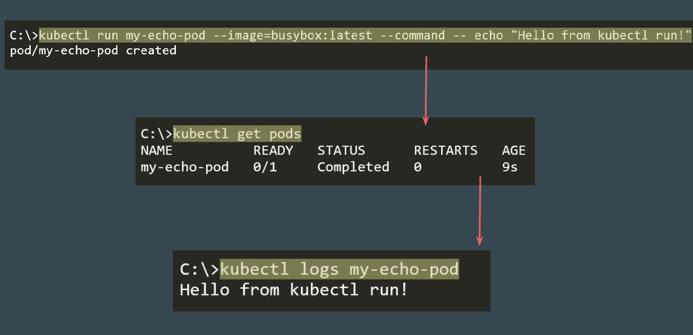

# Commands and Arguments - Practical

Defining Commands and Arguments
The following command denotes the basic syntax to define command and
arguments with kubectl run command:
```
kubectl run nginx --image=nginx --command -- <command> <args>

```

## Example - Create Pod with Specific Command

<div align="center">

</div>

## Defining in Manifest File

Use the command and args field to define the necessary commands and
arguments.

<div align="center">

</div>

