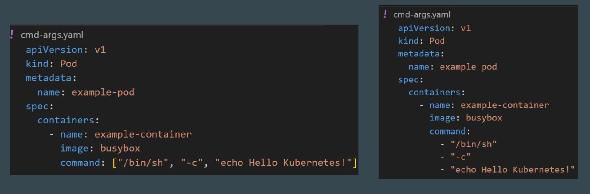
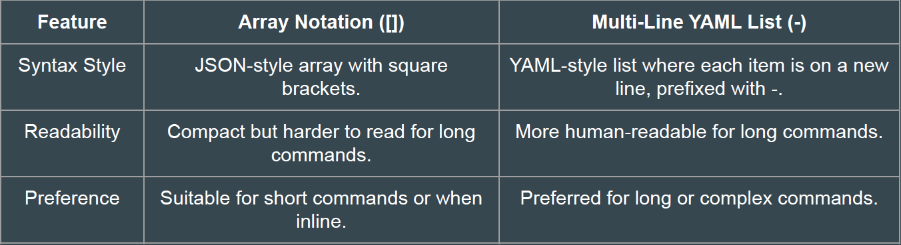

## 1 - Defining Commands and Arguments

In Kubernetes, when defining the command (or args) for a container in a Pod
specification, there are two primary ways to specify them:
 
 - Array (JSON array notation, square brackets []):
 - Multi-Line YAML List (- for each new item)

 

 
 

## High-Level Comparison

 
 

## Generic Recommendation

- Use array notation ([]) for shorter commands.
- Use multi-line YAML lists (-) for longer, more complex commands or when readability is a priority.

## 2 - Command and Arguments

The separation of command and args in Kubernetes is a design choice that
provides flexibility and clarity when working with containerized applications.
However you can add everything in a single command as well.

 
 

## General Recommendation

*command* is intended to specify the entrypoint or the main executable that will run in the container.
*args* is meant to define the arguments or parameters that are passed to the command.
By keeping them separate, the intent of the configuration becomes clearer.

## Points to Note

If a container image defines a default ENTRYPOINT, Kubernetes will use it unless you explicitly override it with command.