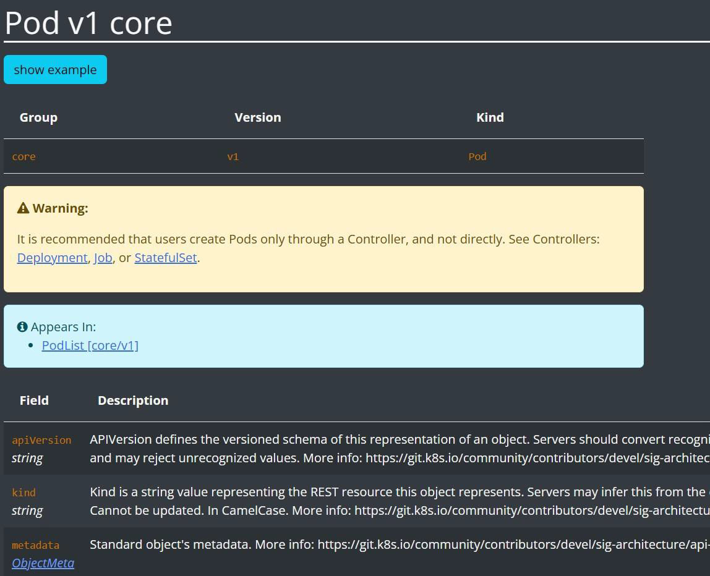
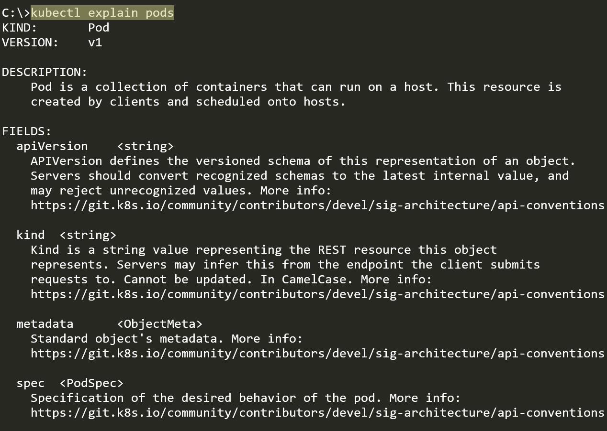
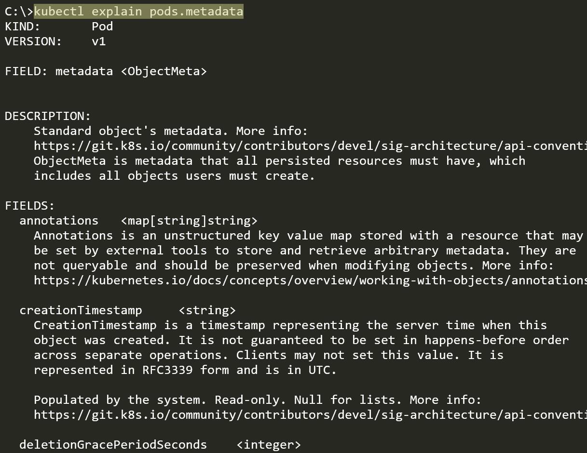

# CLI Documentation for Kubernetes Resources

https://kubernetes.io/docs/home/

## Kubernetes API Documentation

We generally refer to the Kubernetes API Documentation to understand various
fields and associated descriptions for a specific resource.

 
 

## CLI Documentation

You can also use kubectl explain to describe the fields associated with each
supported API resource

 
 

## Similarity to API Doc Hyperlink to See Nested Fields

 
 

