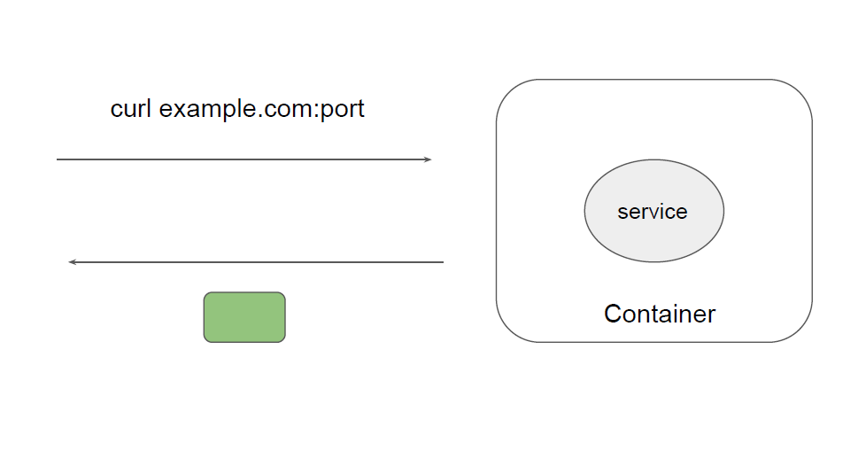
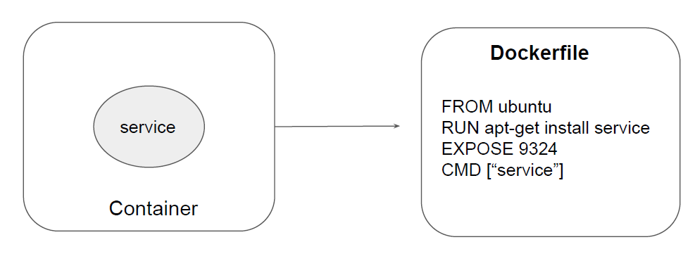

# EXPOSE Build once, use anywhere

## Overview of EXPOSE instruction

The EXPOSE instruction informs Docker that the container listens on the specified
network ports at runtime.
The EXPOSE instruction does not actually publish the port.
It functions as a type of documentation between the person who builds the image and
the person who runs the container, about which ports are intended to be published.

## Understanding the Use-Case

 
 

 

 
 
