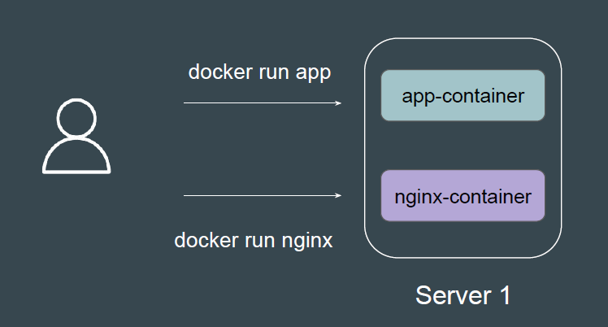
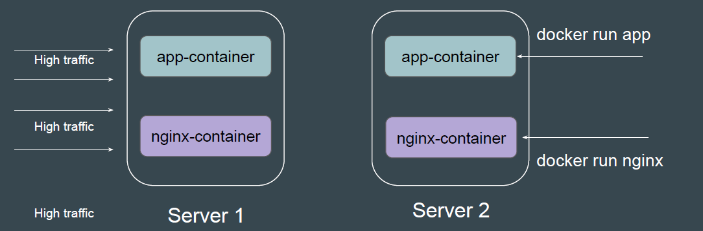
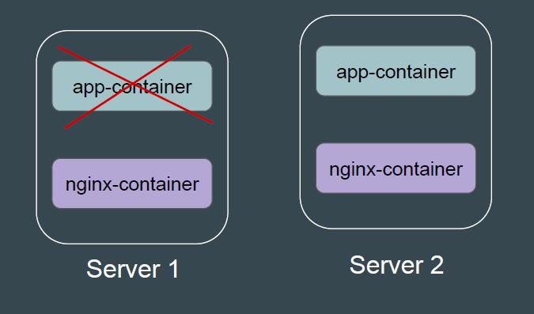
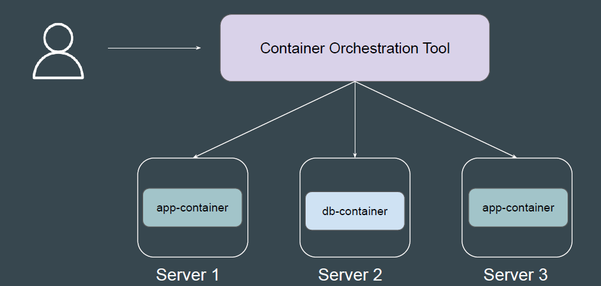
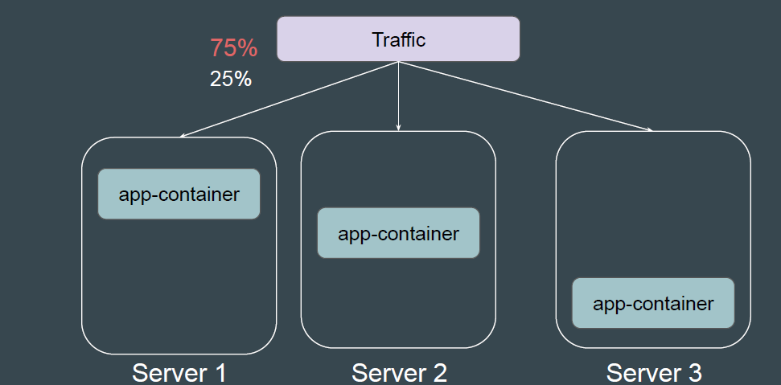
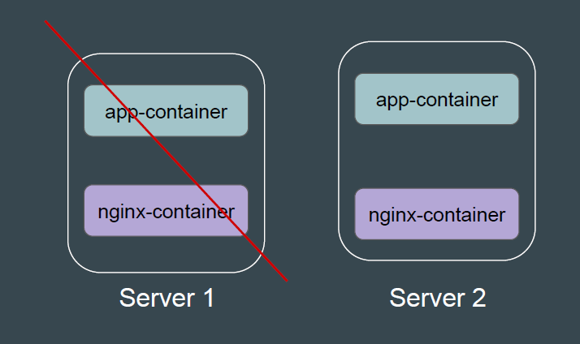
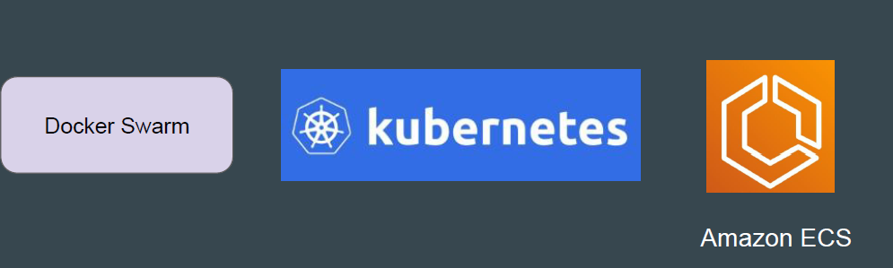

# Overview of Container Orchestration

During the initial times, users relied on manual container management or basic
scripts to handle tasks like deployment, scaling, networking, and monitoring.

## Challenge 1 - Manual Scaling

If an application needed to handle higher traffic, developers had to manually
start additional containers.
This involved identifying which servers had enough resources, deploying new
containers, etc.

## Challenge 2 - Lack of Fault Tolerance

If a container failed (e.g., due to a crash or resource exhaustion,), it wouldn’t
automatically restart without manual intervention in most of the cases.

## Introducing Container Orchestration

*Container orchestration* automates the deployment, management, scaling, and
networking of containers.

## Solving Challenge - Scaling

Orchestration tools CAN automatically scale containers up or down based on
defined policies and real-time traffic.

## Solving Challenge - Fault Tolerance

Failed containers are automatically restarted or replaced to ensure high
availability.

## Container Orchestration is LOT More

Container orchestration is the process of automating the networking and
management of containers so you can deploy applications at scale

- Provisioning and deployment
- Configuration and scheduling
- Resource allocation
- Load balancing and traffic routing
- Monitoring container health
- Keeping interactions between containers secure

There are multiple set of Container Orchestration tools available in the Industry.
Based on the organization and requirement, you can choose tools per
preference.

