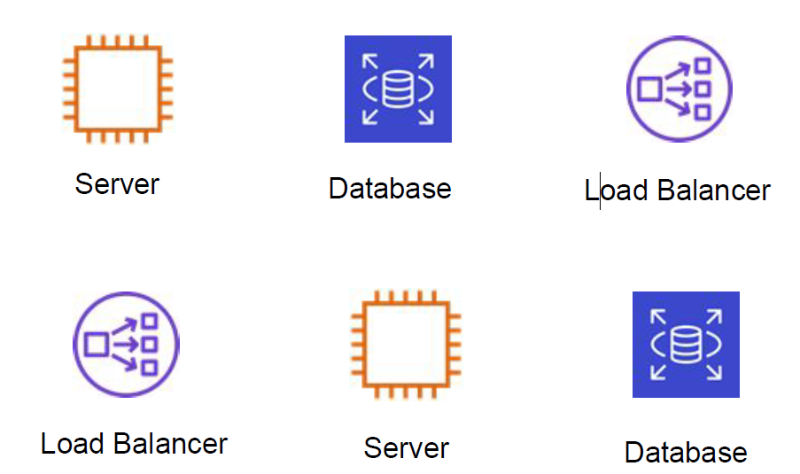
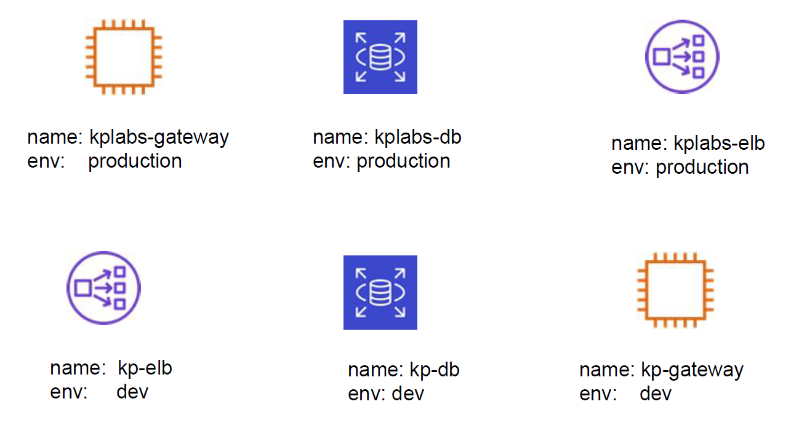
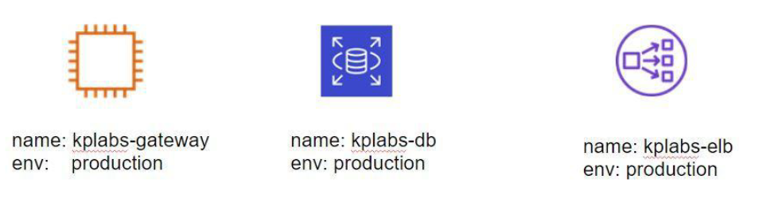
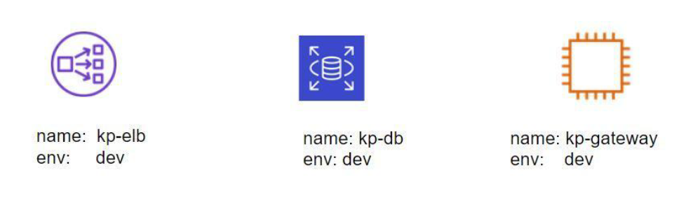
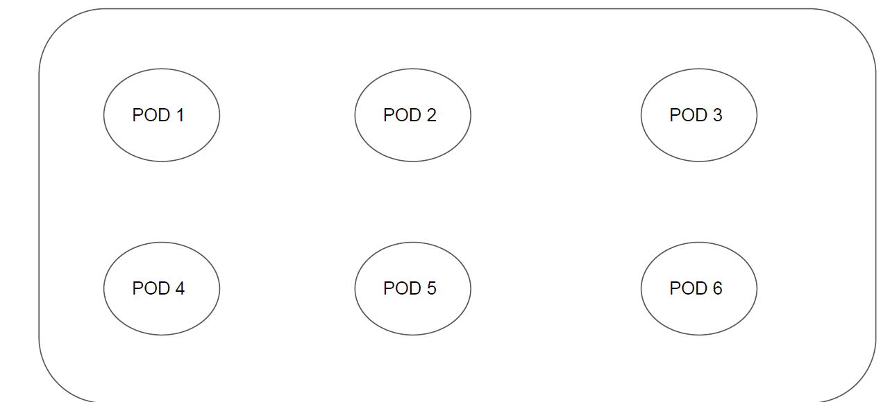
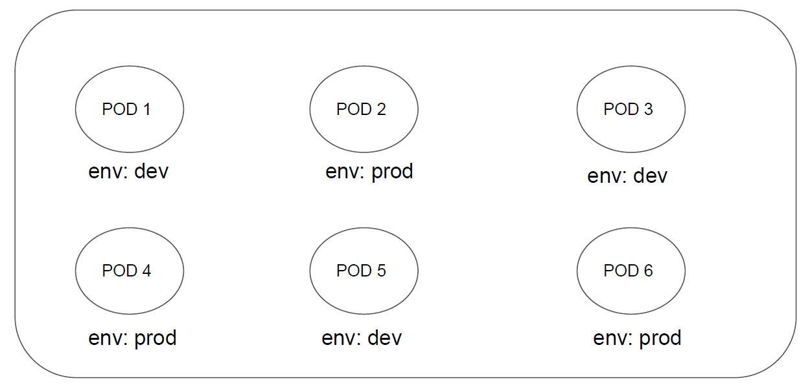

# Labels and Selectors

## Overview of labels

Labels are key/value pairs that are attached to objects, such as pods.
the follwing pictures show some objects in AWS whih no labales.

 
 

## Adding Labels to Resource

 
 

## Overview of Selectors

Selectors allows us to filter objects based on labels.
Example:

1. Show me all the objects which has label where env: prod

 
 

2. Show me all the objects which has label where env: dev

 
 

## Kubernetes Perspective

There can be multiple objects within a Kubernetes cluster.
Some of the objects are as follows:
1. Pods
2. Services
3. Secrets
4. Namespaces
5. Deployments
6. Daemonsets

 
 

## Assigning Labels to Kubernetes Objects

 
 

 
