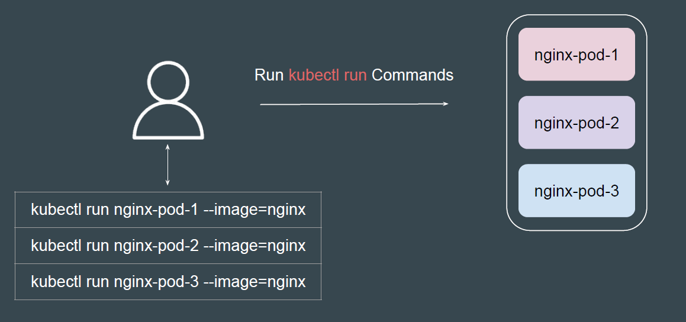
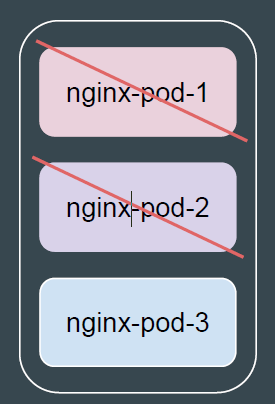
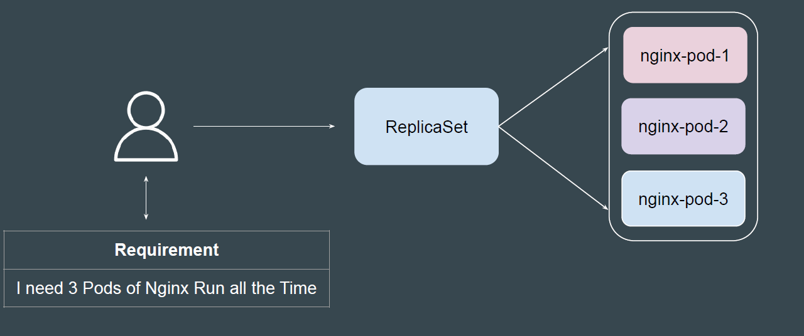

# ReplicaSet

## Setting the Base

There is a requirement to run 3 Pods based on Nginx image all the time.

 
 

 ### Issue with the Manual Step - Part 1

 If a Pod fails (node failure, process crash, etc.), Kubernetes will not
automatically recreate it.
You would have to manually detect the failure and recreate the Pod.

 
 

### Issue with the Manual Step - Part 2
If you need to scale to more or fewer Pods, you would have to manually create
or delete Pod definitions and apply the changes.
Example: Requirement is to run 20 Pods based on Nginx Image

## Introducing Kubernetes ReplicaSet
A ReplicaSet's purpose is to maintain a stable set of replica Pods running at any
given time.

 
 
