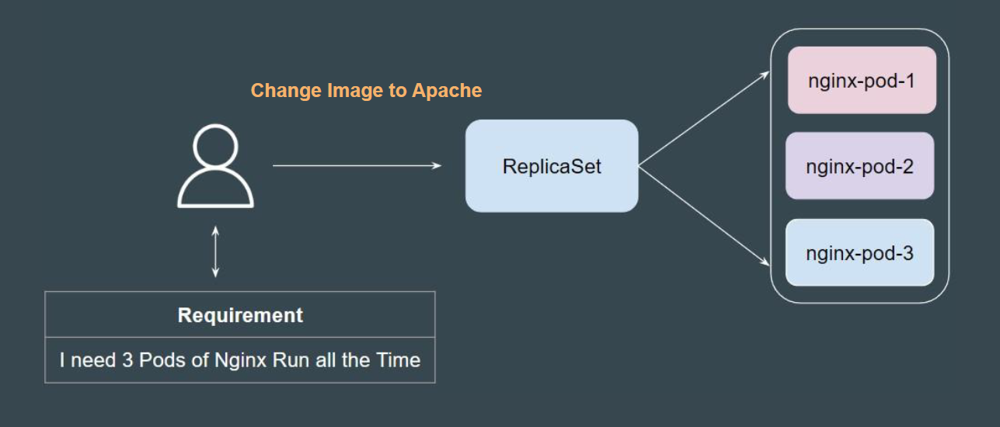
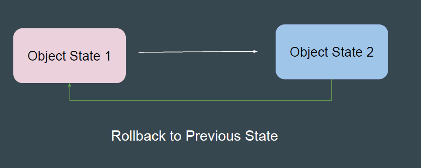
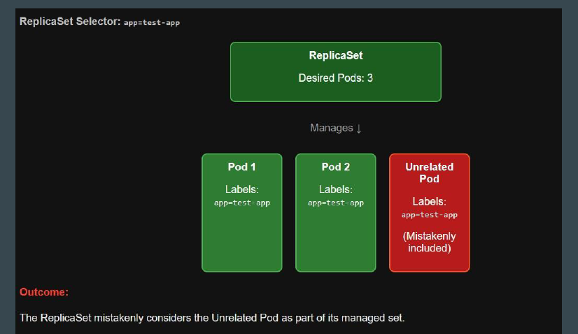

ReplicaSets are primarily designed to maintain a specific state of running Pods,
not to manage regular updates or changes to their configuration

 
 

## Challenge 1 - Updating Container Image
When you update the pod template (e.g., change the container image) in a
ReplicaSet, the existing pods are not updated.

 
 

## Challenge 2 - No Built-In Rollback Mechanism
ReplicaSets lack a rollback mechanism for reverting to a previous configuration
in case of errors during an update.

 
 

## Challenge 3 - Label Collision with ReplicaSet Selectors
When a ReplicaSet's selector matches labels of pods that it didn't create, it
starts treating those pods as part of its managed set. This can cause
unintended consequences.

 
 
