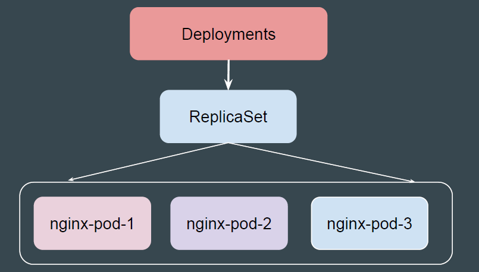
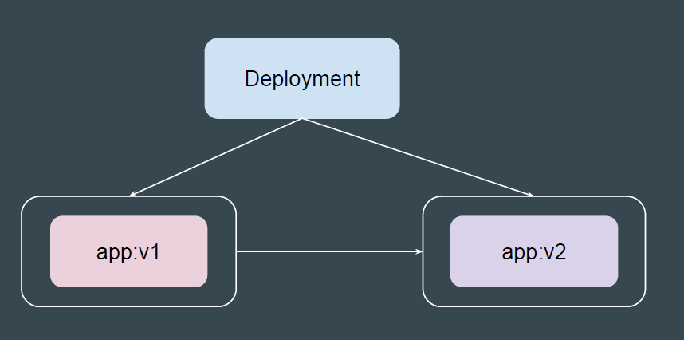
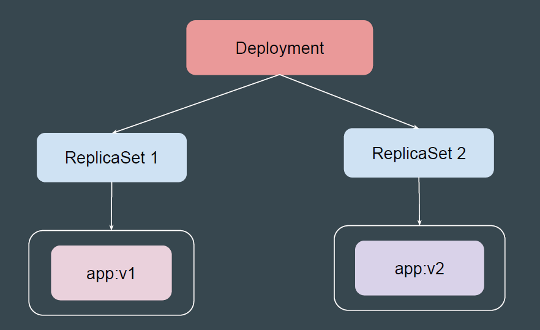
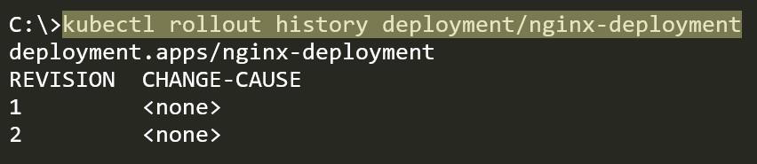

# Overview of Deployments

## Simple Analogy - Camera and Lens

Think of the camera body as the ReplicaSet.
It is the core mechanism that controls and ensures that the right number of
photos (or Pods) are being captured

 
 

## Simple Analogy - Camera and Lens

Now, imagine attaching a big, powerful lens to the camera body. The lens is the
Deployment.
It doesn't just sit on top of the camera; it enhances and extends the camera's
functionality, allowing for new perspectives.

 
 

## Setting the Base

A Deployment is a higher-level abstraction built on top of ReplicaSets.
It not only manages ReplicaSets but also provides advanced features like rolling
updates, rollbacks, and versioning.

 
 

## Use-Case: Update the Container Image

You can easily change the specifications like Container Image and other spec.

 
 

## Use-Case: Rolling Update

Deployments will perform update in rollout manner to ensure that your app is not
down.

 
 

## Rollout History

Deployment allows us to inspect the history of your deployments.
It provides a record of changes made to a deployment over time, enabling you to
understand the evolution of your application and troubleshoot potential issues.

 
 

## Rolling Back Changes

Sometimes, you may want to rollback a Deployment; for example, when the
Deployment is not stable, such as crash looping

 
 

## Key Differences - ReplicaSet and Deployments

| Feature            | ReplicaSet                                      | Deployment                                             |
|--------------------|--------------------------------------------------|--------------------------------------------------------|
| Abstraction Level  | Lower-level                                      | Higher-level                                           |
| Primary Function   | Ensures a specific number of replicas are running | Manages ReplicaSets and handles updates                |
| Rolling Updates    | Not supported                                    | Supported with configurable strategies                 |
| Rollbacks          | Not supported                                    | Supported with version history                         |
| Use Case           | Simple, static workloads                         | Dynamic workloads with frequent updates                |
