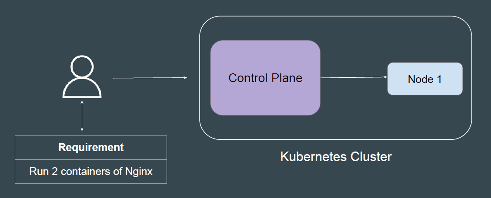
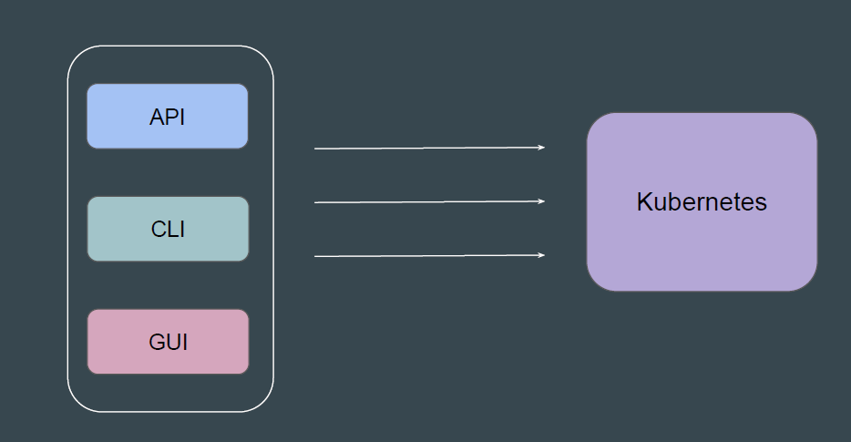
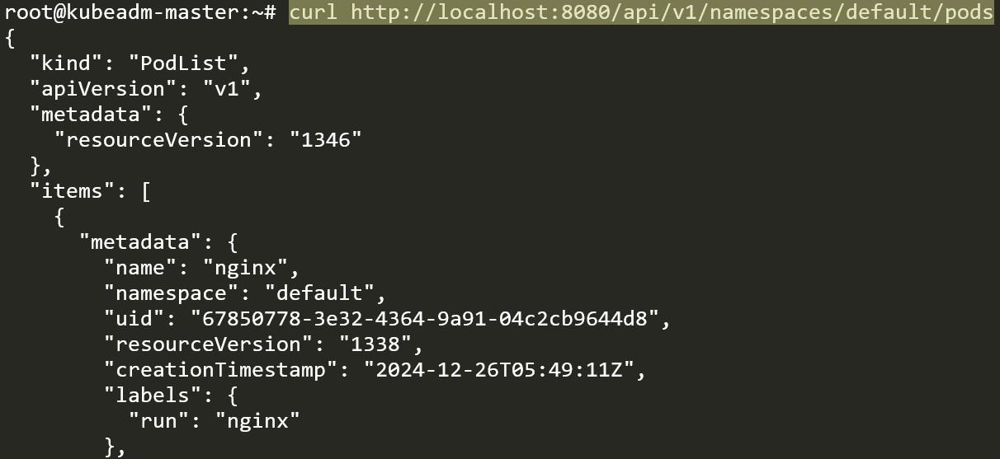
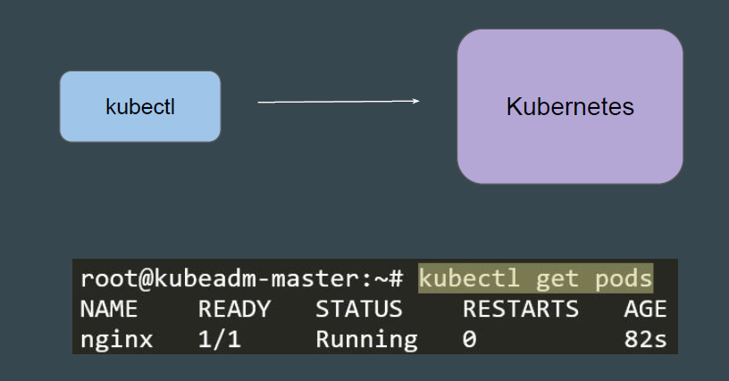
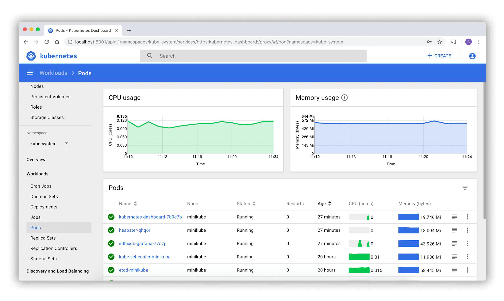

# Connectivity Options for Kubernetes

The first important step after launching Kubernetes cluster is to connect to the
Control Plane.

There are three primary ways to connect to your Kubernetes cluster.

You can use utilities like curl to directly send request to to the API.

To connect to Kubernetes using CLI, you need an important tool named kubectl

Dashboard is a web-based Kubernetes user interface.
You can use Dashboard to deploy, troubleshoot containerized applications and
manage the cluster resources

